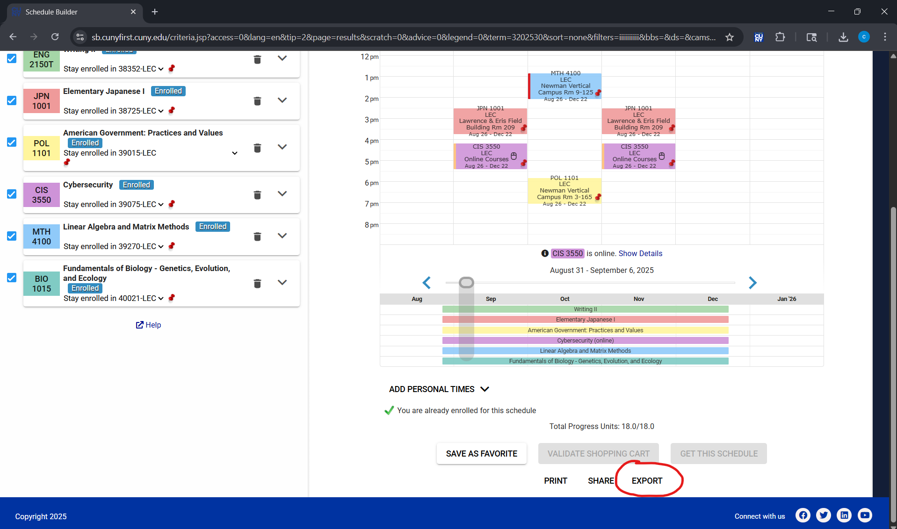
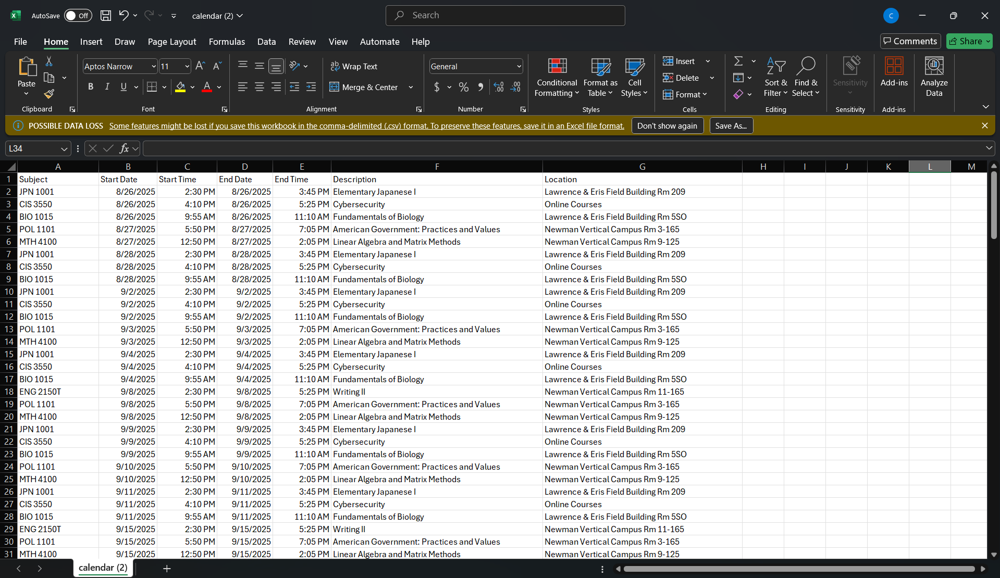
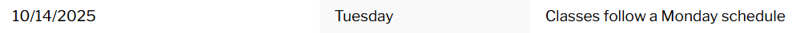
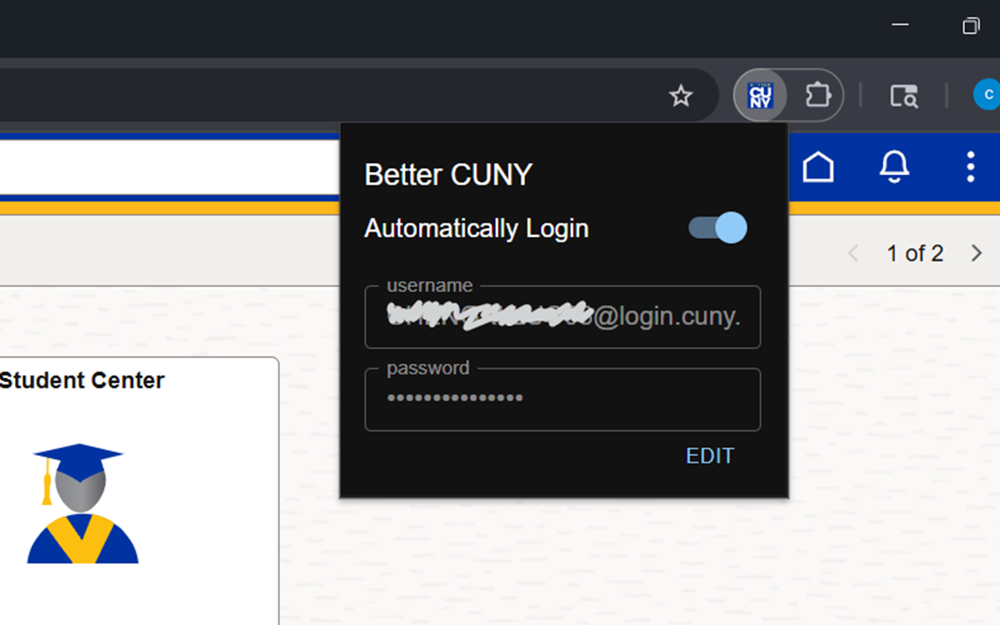

<div align="center">
  <h1>Better CUNY</h1>
  
</div>

---

This is a browser extension designed for CUNY websites(CUNYfirst, BrightSpace, etc.), built with 
[WXT](https://wxt.dev/), 
[React](https://react.dev/), and 
[Material-UI](https://mui.com/material-ui/).

<p align="center">
  <a href="#-installation">Installation</a>
  &bull;
  <a href="#-features">Features</a>
  &bull;
  <a href="#-contribution">Contribution</a>
  &bull;
   <a href="#-support">Support</a>
</p>


---

## 🤺 Installation

### Option 1: Install in Chrome Web Store <font color="orange">(Best Choice)</font>
Click this link: [Download Better CUNY in Chrome Web Store](https://chromewebstore.google.com/detail/better-cuny/agocaomnajflfpeefnofioffegkkcoic)

### Option 2: Compile Source Code 🛠️

1. Clone the repository:
    ```bash
    git clone https://github.com/chengxilo/better-cuny.git
    ```

2. Install dependencies:
    ```bash
    pnpm install
    ```

3. Build the source code:
    ```bash
    pnpm run build
    ```

4. Open `chrome://extensions/` in your browser, enable `Developer mode`, click `Load unpacked`,
   and select the `.output/chrome-mv3` folder in the **project directory**.


### Options 3
Download `chrome-mv3.zip` in your browser, enable `Developer mode`, click `Load unpacked`,
and select the extracted directory. (Actually it is almost the same as Option 2-step 4)

---

## 😎 Features
Currently, we support:
- [📆 Export Schedule to CSV](#-export-schedule-to-csv)
- [😏 Automatically Login](#-automatically-login)
- <font color="orange">**It's always encouraged to post the feature you want on [GitHub](https://github.com/chengxilo/better-cuny/issues)**</font>

### 📆 Export Schedule to CSV

On your Schedule Builder page, click the `EXPORT` button:



This will download a `.csv` file, which you can import into Google Calendar.



Unlike the default Schedule Builder, this extension provides **more accurate results** by combining data from your 
webpage and the official [CUNY Academic Calendar](https://www.cuny.edu/academics/academic-calendars/):



It accounts for special situations (like rescheduled classes) that the Schedule Builder might overlook.
<font style="color:red">However, this is based on webpage content — your professor and classmates are always more 
trustworthy sources for the most accurate information.</font>

### 😏 Automatically Login

We all know how annoying it is that CUNYfirst always requires you to log in. Even if you use Google to remember your 
password, you still have to manually click the login button.

This extension makes things easier by automatically logging you into your CUNY account. Whether you're accessing 
Brightspace, CUNYfirst, or any other CUNY service, the extension will fill in your username and password and click the login button for you—saving you time and hassle.


And of course, you can easily turn this feature on or off whenever you want.

### 🤖 More Features Coming Soon

Stay tuned!

---

## 🪁 Contribution

Issues and pull requests are welcome! You’re encouraged to:

- 📄 Improve the documentation
- ✨ Add new features
- 🪲 Fix bugs
- 💡 Suggest ideas or improvements!

---

## ⭐ Support

If you enjoy using this extension, please:

- Give it a ⭐ on GitHub
- Recommend it to your friends

Thank you so much for your support !!!


